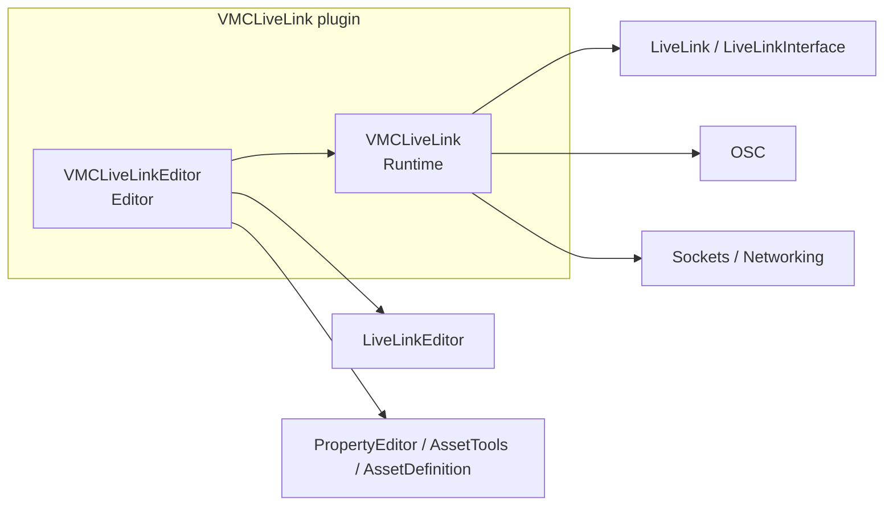
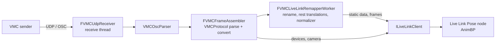
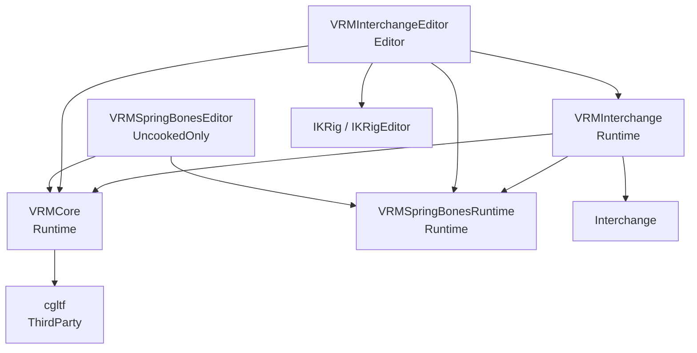
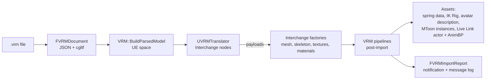

# Architecture

This document describes how the two plugins in this repository are built: their modules, how data flows through them, which threads do what, the coordinate conventions, how saved assets are versioned, and how they are tested. For how to use them, see the [VMC Live Link README](../Plugins/VMCLiveLink/README.md) and the [VRM Interchange README](../Plugins/VRMInterchange/README.md). For how to build and contribute, see [CONTRIBUTING.md](../CONTRIBUTING.md).

The two plugins ship separately (on Fab) and neither depends on the other. Each depends only on plugins that ship with Unreal (decision D-4 in the [refactor plan](../Planning%20Docs/Code_Review_and_Refactor_Plan_2026-09.md)). They cooperate through a documented convention instead: VRM Interchange writes the humanoid bone map onto the skeletal mesh as editor metadata, and VMC Live Link reads it (see [Humanoid Map Metadata](#humanoid-map-metadata)).

Both are built and tested on Windows (Win64) with UE 5.6, 5.7 and 5.8, from one source tree. Where the engines differ, the code uses `UE_VERSION_NEWER_THAN_OR_EQUAL` guards (for example UE 5.8's Interchange joint nodes in `VRMTranslator.cpp`), and the content is saved from 5.6, the oldest (see [CONTRIBUTING.md](../CONTRIBUTING.md)). The [support plan](../Planning%20Docs/UE_5.7_5.8_Support_Plan_2026-10.md) lists every difference.

## VMC Live Link

### VMC modules

| Module | Type | Contents |
|---|---|---|
| **VMCLiveLink** | Runtime | The Live Link source (`FVMCLiveLinkSource`) and its factory and settings; the UDP receiver (`FVMCUdpReceiver`) and OSC parser (`VMCOscParser`); VMC message parsing (`VMCProtocol`); frame assembly (`FVMCFrameAssembler`); the humanoid skeleton table (`VMCHumanoid`); the sender filter; diagnostics (`VMCSourceDiagnostics`, `VMC.Stats`); the remapper (`UVMCLiveLinkRemapper` and its worker) and the mapping asset (`UVMCLiveLinkMappingAsset`); project settings (`UVMCLiveLinkSettings`). |
| **VMCLiveLinkEditor** | Editor | The remapper's details panel (`FVMCLiveLinkRemapperCustomization`) with the live mapping table (`SVMCMappingTable`), and the same tools in the Live Link panel's subject details, where the remapper is shown inline (`FVMCLiveLinkSubjectSettingsCustomization`); the mapping asset's asset definition and factory; the retarget actor factory; reading editor metadata for the remapper (`UVMCLiveLinkRemapper::ReadAssetMetadata`). |

### VMC data flow

1. **Receive.** `FVMCUdpReceiver` reads datagrams on its own thread and timestamps each on arrival. With **Receive Thread** off, the OSC plugin's `UOSCServer` delivers messages on the game thread instead; both paths feed the same code from step 3 on.
2. **Parse.** `VMCOscParser` walks the packet (bundles nested up to 8 deep) and hands each message's address and arguments over as views into the packet, without copying or allocating.
3. **Classify and convert.** `VMCProtocol::ClassifyAddress` identifies the message; `FVMCFrameAssembler::ApplyMessage` parses its arguments, converts the transform to UE space (see [Coordinate conventions](#coordinate-conventions)) and stores it by index. The published skeleton is `root`, then the 55 Unity humanoid bones in a fixed order and hierarchy (`VMCHumanoid`), then any other bone in arrival order, parented to Hips. Indices never change once assigned.
4. **Remap.** When the subject has a `UVMCLiveLinkRemapper`, the source applies it itself: the game thread copies its settings (`MakeConfig`) into the source's snapshot, and the frame-building thread runs an `FVMCLiveLinkRemapperWorker` made from them over the static data and every frame. It renames bones and curves, gives rotation-only bones the reference skeleton's rest translations, and adds normalizer curves. Its per-name work is resolved once in `RemapStaticData`; `RemapFrameData` copies by index. The source does this, not Live Link, because Live Link (UE 5.6 to 5.8) evaluates a subject with the static data its source pushed: a remapper's renamed copy reaches the subject's consumers only for the frame that was current when the remapper changed. The source marks the remapper (`SetAppliedBySource`), and the worker the remapper then gives Live Link (`CreateWorker`) passes everything through; on another source's subject Live Link gets the full worker.
5. **Publish.** On `/VMC/Ext/Blend/Apply`, the source pushes the static data to Live Link if a bone or curve was added, a setting changed or the remapper changed, then pushes the frame with its arrival time. Devices and the camera are pushed as their own subjects as they arrive.
6. **Animate.** A Live Link Pose node in an Animation Blueprint reads the remapped subject.

### VMC threading

`FVMCLiveLinkSource` builds frames on one thread at a time: the receive thread by default, or the game thread when **Receive Thread** is off (decision D-1).

- **Game thread:** creating the subject and its settings (UObjects), handling settings edits, starting and stopping the receive paths, the status text, `VMC.Stats`, and the remapper's editing tools.
- **Frame-building thread:** parsing, assembly and pushing to Live Link. It reads the settings through an immutable snapshot (`FSnapshot`) that the game thread publishes under a lock; a new snapshot version republishes the static data.
- **Bootstrap:** the subject must exist before frames are pushed. The receive thread asks the game thread to create it (`Tick`) and drops frames until it has.
- **Switching** the path, port, bind address or subject stops the old path before the new one starts, so the two never run at once.
- **Shared state:** frame timing, the last sender and the published names are read by the game thread for the status and the mapping table, under `StatsLock`. Message counters are atomics.
- **The remapper's settings** reach the frame-building thread as a copy (`FVMCRemapConfig`) in the source's snapshot, taken on the game thread whenever the remapper's revision changes. The worker made from it is used only by the frame-building thread, and replaced with each static data push.

### Humanoid map metadata

A skeletal mesh may carry editor metadata `VRM.Humanoid.<UnityBoneName>` = its bone name, plus `VRM.HumanoidVersion` = `1`. VRM Interchange writes it on import; `UVMCLiveLinkRemapper::MapBonesFromHumanoidMetadata` reads it (through the editor module, since the runtime module can't read editor metadata). Unity bone names are what VMC senders stream, so this maps a VMC stream onto the mesh exactly. Other tools can write the same keys.

## VRM Interchange

### VRM modules

| Module | Type | Contents |
|---|---|---|
| **VRMCore** | Runtime | `FVRMDocument`: a `.vrm`/`.glb`/`.gltf` file read and parsed once (JSON, nodes, version, and geometry through cgltf). `VRM::BuildParsedModel`: skeleton, meshes, morph targets, images and materials in UE space. The avatar data (humanoid map, expressions, look-at, meta) and its parser, the `UVRMAvatarDescription` asset, the MToon and material parameter parser, the coordinate conversion, and the VRM Expressions anim node. The only module that uses cgltf. |
| **VRMInterchange** | Runtime | `UVRMTranslator`, the Interchange translator for `.vrm`: builds the Interchange node graph from the parsed model and serves mesh and texture payloads. The spring bone parser and validation. `VRM::ImportMessages`, which collects an import's warnings for the editor's report. |
| **VRMInterchangeEditor** | Editor | The post-import pipelines: spring bones, IK Rig, Live Link scaffold and avatar description on `UVRMPipelineBase`, and the material pipeline, which derives from `UInterchangePipelineBase` directly; the IK Rig builder; the MToon master materials, built in C++; the import report (notification and message log); pipeline registration (each pipeline is registered as an asset in `Content/DefaultPipelines`, since Interchange instantiates only pipeline assets; a new pipeline needs one) and project settings; the spring data details panel. |
| **VRMSpringBonesRuntime** | Runtime | `UVRMSpringBoneData` (the spring configuration asset and its custom version), `FVRMSpringSolver`, and the `FAnimNode_VRMSpringBones` anim node. |
| **VRMSpringBonesEditor** | UncookedOnly | The AnimGraph nodes for spring bones and VRM Expressions. |

### VRM data flow

1. **Translate.** `UVRMTranslator::Translate` opens the file once as an `FVRMDocument` and builds the parsed model: the skeleton from the skin joints and the spring nodes below them that no skin lists (rest rotations reset to identity, decision D-3), meshes, morph targets, images and materials, all converted to UE space. It creates the Interchange node graph from it, and stores the document's JSON and the avatar data on an `UInterchangeVRMNode`, from which the spring bone pipeline parses the springs.
2. **Payloads.** Interchange asks the translator for mesh and texture payloads, which it builds on worker threads from the `FVRMParsedModel` that `Translate` kept (the document itself is released when `Translate` returns).
3. **Factories.** Interchange's own factories create the skeletal mesh, skeleton, physics asset, textures and materials.
4. **Pipelines.** Each VRM pipeline stages its work in `ExecutePipeline`, then Interchange reports every asset this import created to `ExecutePostImportPipeline`. When the skeletal mesh arrives, the pipelines create their assets: the spring data, the IK Rig (retarget chains from the humanoid map), the avatar description (and the humanoid metadata on the mesh), the MToon material instances and outline overlay, and the Live Link actor and Animation Blueprint copied from templates.
5. **Report.** `FVRMImportReport` collects what was imported and the warnings logged under each file, and shows a notification and a message log page.

At runtime, `FAnimNode_VRMSpringBones` simulates the spring data on the animated pose, and `FAnimNode_VRMExpressions` turns expression curves into the avatar's morph target curves.

### VRM threading

- **Translation** runs where Interchange runs it, and **payloads** run on Interchange's worker threads, in parallel. They share the translator's `FVRMParsedModel`, which is read-only after `Translate`; the one mutable shared member is the cached base mesh payload, under `BasePayloadLock`.
- **Pipelines:** `ExecutePipeline` may run on any thread (`UVRMPipelineBase::CanExecuteOnAnyThread`); post-import runs on the game thread, since it creates assets. The material pipeline runs entirely on the game thread, since it builds materials.
- **Import messages:** `VRM::ImportMessages` attributes a log line to the file the logging thread is importing, through a thread-local scope stack (`FScope`) set in `Translate`, the payload calls and each pipeline. It assumes `FOutputDeviceRedirector` calls a device that can be used on any thread on the logging thread itself. A line that can't be attributed is listed apart on the report.
- **Spring bones:** the anim node runs on animation worker threads. It caches its chains per instance and rebuilds them when the asset, its `EditRevision` or its `SourceHash` changes; editing tools on the game thread bump `EditRevision`. The solver steps at a fixed rate (`SubstepHz`) and caps a long frame at `MaxDeltaTime`.

## Coordinate conventions

UE space is left-handed, Z up, in centimetres. A character faces +Y, like the UE mannequin.

| Source | Space | Conversion to UE |
|---|---|---|
| VMC (Unity) | Left-handed, Y up, Z forward, metres | Position (x, y, z) → (−x, z, y) × 100. Quaternion (x, y, z, w) → (−x, z, y, w). A rotation of the axes, so left stays left. Then the optional yaw offset about UE Z, for the root, devices and camera only (bone-local transforms aren't turned). |
| glTF / VRM | Right-handed, Y up, metres | Position (x, y, z) → (x, z, y) × 100. Quaternion (x, y, z, w) → (−x, −z, −y, w). Swapping Y and Z is a reflection, which converts handedness. VRM 0.x models, which face −Z, also get a 180° turn about UE Z (for positions (−x, −y, z); for quaternions X and Y negated again). |

Both conversions put the character's forward (Unity +Z, VRM 1.0 +Z) on UE +Y, so a VRM imported by VRM Interchange and a VMC stream agree without a yaw offset.

**Worked example (VMC).** A sender puts the hips 1 m up and 0.5 m forward: Unity (0, 1, 0.5) m. UE: (−0, 0.5, 1) × 100 = (0, 50, 100) cm, which is 50 cm along the character's forward (+Y) and 100 cm up (+Z). The head turned 30° to the character's right is Unity quaternion (0, 0.259, 0, 0.966), +30° about Unity Y, which turns +Z toward +X. In UE it is (0, 0, 0.259, 0.966), +30° about Z, which turns +Y toward −X; Unity +X maps to UE −X, so that is still the character's right.

**Worked example (VRM).** A VRM 1.0 joint at glTF (0.1, 1.5, 0.02) m imports at UE (10, 2, 150) cm. The same joint in a VRM 0.x file, whose model faces −Z, is at glTF (−0.1, 1.5, −0.02); the axis swap gives (−10, −2, 150) and the 180° turn gives (10, 2, 150), the same place.

**Rest pose.** Imported bones have identity rest rotations, so each bone's local transform is a translation only. This matches VMC, which streams rotations relative to such a pose (VRM's normalized T-pose), so a VMC stream drives a VRM Interchange mesh by renaming alone. Spring colliders, gravity and joint data go through the same conversion as the mesh.

## Asset versioning

| Asset | Mechanism |
|---|---|
| `UVRMSpringBoneData` | `FVRMSpringDataCustomVersion`. Each version that changes the meaning of saved data adds an entry; `PostLoad` upgrades what it can (for example, copying per-spring parameters to joints) and flags data that needs a reimport. The asset records the version it was loaded with (`LoadedDataVersion`). |
| `M_VRM_MToon`, `M_VRM_MToonOutline` | Built by the plugin in C++, with the graph version stored as an internal scalar parameter. A newer plugin whose graph changed rebuilds them in place, keeping references. |
| `UVMCLiveLinkMappingAsset` | `SignatureVersion`. Signatures saved by an older version of `ComputeSignature` are recomputed from the example meshes the first time the asset is matched (`MatchesMesh`) or edited, not in `PostLoad` (loading other assets there isn't safe). Until then the asset's registry tag doesn't list them. |
| Live Link connection string | `FVMCConnectionSettings::FromString` reads every earlier format; unknown keys are ignored. |
| Generated assets (IK Rig, AnimBP, actor) | Not versioned. By default a reimport creates new copies under unique names. With the pipelines' **Update Existing** option, the IK Rig is rebuilt in place, and the actor and AnimBP are reused (pointed at the new mesh, user edits kept); they don't pick up changes to the plugin's templates. The avatar description, spring data and IK Rig are updated in place by default. |

A change to a saved `USTRUCT`/`UCLASS` layout, or to what saved data means, must add a version and an upgrade path, with a test that loads the old form (rule 5 of the plan's B.0 rules).

## Test strategy

Every test is an Unreal automation test, run headless by CI on every pull request (`Automation RunTests VRM.+VMC.`). Branch protection on `main` requires the CI check (`build-and-test`), so a pull request with a failed test can't merge. No test may report a warning either, but CI doesn't fail on one: the warning count is checked by hand, on the `Tests:` line of the test step (also in CI's success comment).

| Area | Tests | What they cover |
|---|---|---|
| VMC protocol | `VMC.Protocol.*`, `VMC.OscParser.*`, `VMC.Humanoid` | Every address and argument form, malformed input, bundles, the coordinate conversion. |
| VMC assembly and source | `VMC.FrameAssembler.*`, `VMC.Receiver`, `VMC.SenderFilter`, `VMC.ConnectionSettings.*`, `VMC.Diagnostics.*` | Frames, static data, curve holding, devices, the socket, sender filtering, settings round trips, status texts. |
| VMC replay | `VMC.Replay` | A synthetic capture (`Plugins/VMCLiveLink/Tests/Captures`) replayed through the OSC parser and the frame assembler (not the source, Live Link or the remapper). |
| Remapper | `VMC.Remapper.*`, `VMC.MappingAsset.*` | Presets, the normalizer, rest translations, humanoid metadata, signatures, the mapping table. |
| VRM parsing | `VRM.Document.*`, `VRM.Coordinates.*`, `VRM.Avatar.*`, `VRM.Materials.*`, `VRM.Textures.*`, `VRM.MorphTargets` | The document, conversions, avatar data, MToon and PBR parameters, texture decoding, morph targets. |
| VRM import | `VRM.Translator`, `VRM.Pipeline.*`, `VRM.IKRig.*`, `VRM.Import.*`, `VRM.Integration.*`, `VRM.Fixtures.*` | Full imports of the fixtures through Interchange, each pipeline's output, the import report. |
| Spring bones | `VRM.SpringBones.*` | Parsing both VRM versions, validation, custom version upgrades, the solver (colliders, gravity, branches, sub-steps, frame-rate independence, center space), the anim node (swapping data, LOD changes, live edits), the editing tools. |
| Expressions | `VRM.Expressions.*` | The expression node's rules for both VRM versions. |
| Performance | `VMC.Perf.*`, `VRM.Perf.*` | Timings for the VMC hot path, the spring solver, mesh payloads and texture decoding, reported in the test log. They don't fail on a slowdown. |

**Fixtures.** The VRM fixtures in `Plugins/VRMInterchange/Tests/Fixtures` are small synthetic files made by `scripts/make_vrm_fixtures.py`, each with an `.expected.json` of the values an importer should produce. `scripts/check_vrm_fixtures.py` validates them with cgltf. Only synthetic fixtures and captures of our own are committed (decision D-8). The VMC captures are recorded or generated with `scripts/vmc_sender.py`.

**What tests don't cover:** the editor UI (panels, notifications, buttons) and real senders and avatars. Those are checked by hand in the editor, with the steps in [EDITOR_TESTS.md](EDITOR_TESTS.md).
